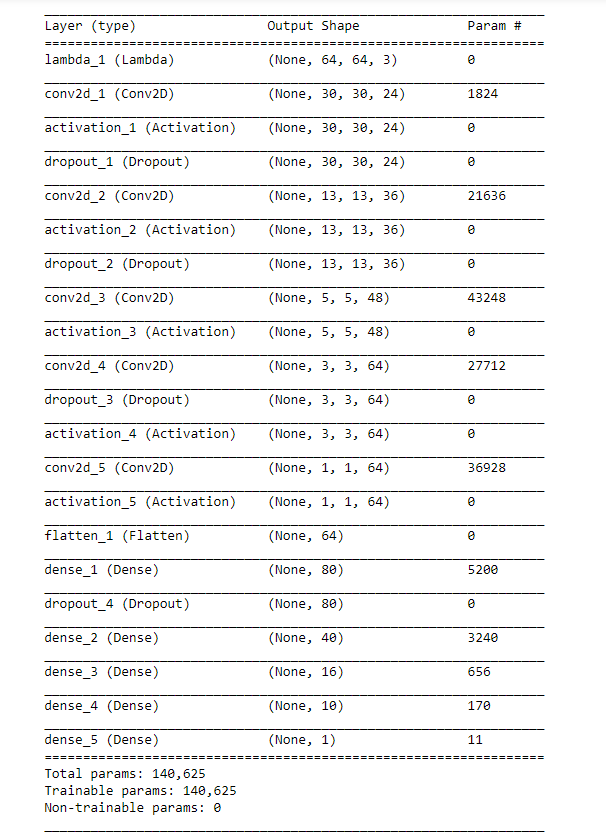

# **Behavioral Cloning** 

The goals / steps of this project are the following:
* Use the simulator to collect data of good driving behavior
* Build, a convolution neural network in Keras that predicts steering angles from images
* Train and validate the model with a training and validation set
* Test that the model successfully drives around track one without leaving the road
* Summarize the results with a written report

## Rubric Points
### Here I will consider the [rubric points](https://review.udacity.com/#!/rubrics/432/view) individually and describe how I addressed each point in my implementation.  

---

## **Model Architecture and Training Strategy**

### 1. An appropriate model architecture has been employed

My model consists of a convolution neural network with 3x3 and 5x5 filter sizes and depths between 24 and 64 (model.py lines 196-207)   
The model includes RELU layers to introduce nonlinearity (code line 196-208), and the data is normalized inside the model using a Keras lambda layer (code line 195).   
Even though I used the Nvidia Model for predicting the steering angle, I choose to reduce the depth of the fully connected layers. 

### 2. Attempts to reduce overfitting in the model

The model contains dropout layers in order to reduce overfitting (model.py lines 198-211). 

The model was trained and validated on different data sets to ensure that the model was not overfitting (code line 43). The model was tested by running it through the simulator and ensuring that the vehicle could stay on the track.

### 3. Model parameter tuning

The model used an adam optimizer, so the learning rate was not tuned manually (model.py line 216).

### 4. Appropriate training data

Training data was chosen to keep the vehicle driving on the road.  
I used a combination of the udacity training data and some  
additional data driving curves on the track to ensure the model was save driving safe.  
To prevent overfitting on the turns, I recorded them always in slightly different behaviour (position on the road)  
so that the mean would be somewhat the middle of the road. Additionally I recorded the turns from the other  
side of the road to have another data point.

## **Model Architecture and Training Strategy**

### **1. Solution Design Approach**

The overall strategy for deriving a model architecture was a lot of testing and reading on the internet, 
at the end I decided to choose the Nvidia-Model designed to solve the same task in a real world scenario.  
But I did not use the **L2-Regularizer** and moved the **Dropout-Layers** more into the **Conv2D-Layers**, since in my Opinion it was more human like learning this way.   
Humans start driving in daylight when they are new to driving cars, after some training they start driving at night and with rain. (night and rain are the Dropout-Layers in this example)   

In order to gauge how well the model was working, I split my image and steering angle data into a training and validation set. I found that my first model(Nvidia Model) had a low mean squared error on the training set but a high mean squared error on the validation set. This implied that the model was overfitting.  
After some research I determined the that the Model from Nvidia did need much more training data to be effective in use. This was the moment I developed the idea mentioned above.  
Additionally I noticed the long training time of this network and the number of trainable parameters. Since this was just for a simulator I reduced the depth of the model and reduced the number  
of trainable parameters by a factor of 10.   

To combat the overfitting, I modified the model with Dropout-Layers, I could have added L2-Regularizers but it was enough with the Dropout-Layers and the generated data from my **generator-functions**  

The final step was to run the simulator to see how well the car was driving around track one. There were a few spots where the vehicle slightly crossed the line. To improve this behaviour in   
turns I recorded a small set of additional data containing only turns. To prevent overfitting, I aswell recorded the same turns from the other side of the road.

At the end of the process, the vehicle is able to drive autonomously around the track without leaving the road.

## 2. Final Model Architecture

The final model architecture (model.py lines 194-215) consisted of a convolution neural network with the following layers and layer sizes ...  
  
With a Dropout-Layer after almost all **Conv2D-Layers** except the last one. The Fully-Connected layers  
were used to at the end determine the **steering angle**  

### **3. Creation of the Training Set & Training Process**

To capture good driving behavior, I used the trainingset provided by udacity, and some turn-driving data recorded by myself.  
While recording my driving behaviour, I for example recorded the turns from both sides of the street. This ensured I got enough  
different data points to prevent overfitting.  

Additionally to the data set, I thought myself since this was not a lot of training data, how could I prevent overfitting additionally?  
The answer was in the **generator-functions**, there I randomely changed the Lighting in the images and randomely additionally flipped the images.  
Flipping the images needed modification on the steering angle. It had to be multiplied by **-1** to be the correct steering-angle for the image.

After the collection process, I had X number of data points. I then preprocessed this data by cropping the unnecessary parts of the image and  
resizing it, to the shape needed for my Neural Network **(64,64)**. I decided to keep this part outside of the Neural Network, because of big reason  
I prefered having code I could have actually debugged if needed, instead of a somewhat blackboxed behaviour inside the Neural Network.

I finally randomly shuffled the data set and put 10% of the data into a validation set. 

I used this training data for training the model. The validation set helped determine if the model was over or under fitting. The ideal number of epochs was 2 as evidenced by my EarlyStopper,    
provided by the keras API. I used an adam optimizer so that manually training the learning rate wasn't necessary.